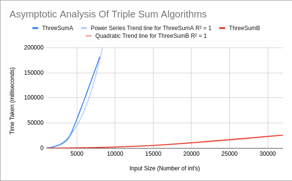
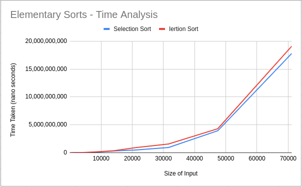
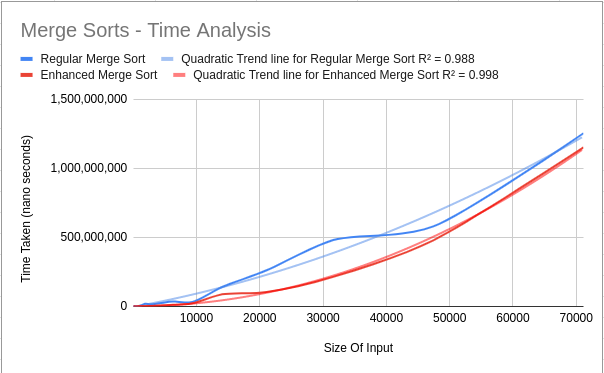
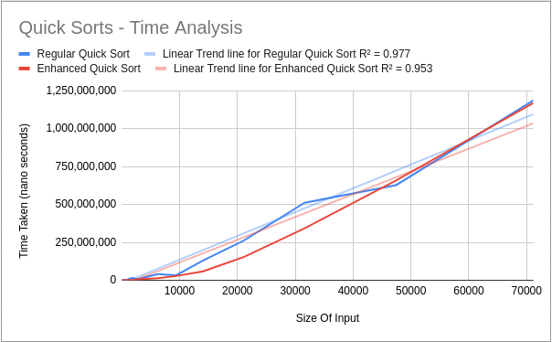
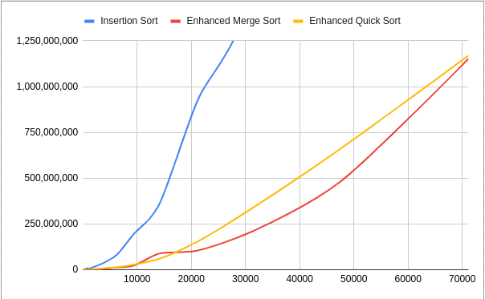
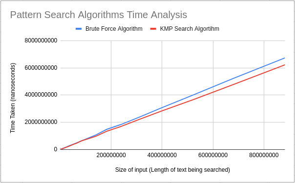

# algorithm-portfolio-20290-thomasreilly1011
A collection of algorithms designed and implemented in Java as a part of my UCD Computer Science, Algorithms class. Included are some of the most popular algorithms/data structures for sorting, searching and compression. In addition to these algorithms you'll find enhanced versions that allow for either better run time efficiency or better memory efficiency. Finally, you will find a series of Benchmark classes that perform an analysis on their respective algorithms. 

## Getting Started & Pre Requisites
To compile or run any of the files in this repository you will need a Java SDK and JRE of 8 or above.
To simply run the provided demo jar you will only need JRE 8 or above. 

To get started, clone the repository to you desired location.
```
git clone https://github.com/CompAlgorithms/algorithm-portfolio-20290-thomasreilly1011.git
```
To simply just run a demonstration of tests on the algorithm, a jar file is available.
 ```
 java -jar demo.jar
 ```
If you wish to run and adjust tests specific tests I would suggest opening the source files in your favourite IDE, searching for the Benchmark classes, adjusting, compiling and running the tests from there.

## File Structure
As you can see, the source files are organised into packages which represent the type of algorithm, and the lab session in which they were studied. Each package has at least one runnable class, in most cases this is a Benchmark class which compares the various algorithms in the package.

## Run Time Analysis of Algorithms Using Tables & Graphs
All table data for these graphs can be found [here](https://docs.google.com/spreadsheets/d/1MmkeZdxXCI8Pb67V6UyhJViVvWnmQ6aw54KjmmmsRVQ/edit?usp=sharing).
### Lab 3 - Asymptotic Time Analysis

Here, we analise two triple sum algorithms ```ThreeSumA``` and ```ThreeSumB```. A range of input sizes are used ranging from 1 thousand inputs to 32 thousand inputs. We observe that for smaller inputs of 1  or 2 thousand it is difficult to see a difference in the efficiency of the algorithms. However, with inputs ranging up to 32 thousand we can see ```ThreeSumA```'s run time follows an exponential trend while ```ThreeSumB```'s run time follows a  quadratic trend.
### Lab 4 - Elementary Sorting Algorithms


Here, we analyse to elementary sorting algorithms, insertion sort and selection sort. We observe that both algorithms just fine with smaller input sizes. However, as input sizes increase run time increases sharply following a quadratic trend.
### Lab 5 - Merge Sort Algorithms


Looking here at two quick sort algorithms. My regular ```QuickSort``` algorithm, again, seems to form intermediary between a quadratic trend, and a logarithmic trend. We also see that the various adjustments to ```MergeSortEnhanced``` causes a slight improvement in performance.
### Lab 6 - Quick Sort Algorithms


Here, we analise two merge sort algorithms. My regular ```MergeSort``` algorithm seems to form intermediary between a quadratic trend, and a logarithmic trend.
#### Summary of Sort Algorithms


Finally, we see the best of all 3 algorithm types side by side. Insertion sort becomes incredibly slow as inputs increase and we should definitely use one of the other two for algorithms for larger values. Worth noting also, is that merge sort performs quicker than quick sort for most of this graph, however, as we can see Quicksort remains slightly more steady at the larger inputs. The cutoff seems to be around 70 or 80 thousand inputs here.
### Lab 7 - Searching Algorithms


During lab 7 we created and analysed two pattern search algorithms. One using a naive, brute force approach and one using the Knuth-Morris Patter Search algorithm. The naive approach runs with worst case time complexity of O(m(n-m+1) while the KMP runs at O(N). This can be seen in the above graph. Its worth also noting KMP works better for more diverse string patterns.

## Author & Influencers
Author: Thomas Reilly - thomas.edreilly@gmail.com 

Module coordinator: Mark Matthews, UCD School of Computer Science
